# 🧠 IndustrialBrain AI

Transforming industrial documents into an intelligent, searchable, AI-powered knowledge ecosystem using OCR, Google Gemini AI, and Knowledge Graphs.

### AI-Powered Industrial Knowledge Intelligence Platform

> **Economic Times AI Hackathon 2.0 – Phase 2 Prototype Submission**

IndustrialBrain AI is an AI-powered platform that transforms scattered industrial documents into an intelligent, searchable, and interactive knowledge ecosystem. It combines OCR, Generative AI, Knowledge Graphs, and modern web technologies to help engineers, operators, and maintenance teams discover information faster, reduce knowledge fragmentation, and improve operational decision-making.

---


# 🌐 Live Demo

> 🚧 Deployment is currently in progress.

The live application links will be updated after deployment.

- Frontend: Coming Soon
- Backend API: Coming Soon

# 📖 Project Overview

Industrial organizations generate and manage large volumes of engineering drawings, maintenance records, inspection reports, operating procedures, safety manuals, and other technical documents. These documents are often stored across multiple disconnected systems, making knowledge retrieval slow, inefficient, and error-prone.

IndustrialBrain AI addresses this challenge by providing a unified AI-powered knowledge platform that enables users to upload industrial documents, extract text using OCR, interact with the content through Generative AI, and visualize relationships using an interactive Knowledge Graph. The platform converts static documents into an intelligent knowledge ecosystem that improves information discovery and supports faster operational decision-making.

# 🎯 Problem Statement

Industrial enterprises rely on thousands of structured and unstructured documents that are often scattered across different storage systems. Engineers, operators, and maintenance teams spend valuable time searching for information, recreating existing documents, and transferring knowledge manually.

The absence of a unified knowledge platform results in:

- Knowledge fragmentation
- Increased maintenance downtime
- Slower troubleshooting
- Operational inefficiencies
- Loss of expert knowledge over time

The challenge is to build an AI-powered platform capable of ingesting heterogeneous industrial documents, extracting meaningful information, and transforming organizational knowledge into an intelligent, searchable, and continuously evolving knowledge base.

# 💡 Our Solution

IndustrialBrain AI provides a unified Industrial Knowledge Intelligence platform that combines document management, Optical Character Recognition (OCR), Generative AI, and Knowledge Graph technology into a single application.

The platform enables users to securely upload industrial documents, automatically extract textual information using OCR, interact with the document content through AI-powered conversations, and visualize relationships between extracted concepts using an interactive Knowledge Graph.

Unlike traditional document repositories, IndustrialBrain AI transforms documents into an interconnected knowledge network, making organizational knowledge easier to discover, understand, and reuse across engineering, maintenance, and operational teams.

# ✨ Key Features

## 🔐 Secure Authentication
- User Registration & Login
- JWT-based Authentication & Authorization
- Protected Routes
- Secure Session Management

---

## 👥 Multi-User Support
- Independent user accounts
- User-specific document storage
- Complete data isolation between users

---

## 📂 Intelligent Document Management
- Upload PDF documents
- Upload scanned PDFs
- Upload image documents
- Preview uploaded documents
- Download documents
- Delete documents

---

## 🔍 OCR & Document Intelligence
- Automatic OCR text extraction
- Supports scanned documents
- Supports image-based documents
- Converts unstructured documents into searchable text

---

## 🤖 AI-Powered Knowledge Assistant
- Ask questions about uploaded documents
- Context-aware AI responses
- AI-generated document explanations
- Interactive document understanding

---

## 🧠 Knowledge Graph
- Automatic Knowledge Graph generation
- Interactive graph visualization
- Search and highlight nodes
- AI explanation for every node
- Reset graph view
- Export graph as PNG

---

## 📊 Dashboard Analytics
- Document Statistics
- Weekly Upload Trends
- File Distribution
- Recent Activities
- Recent Documents

---

## 🎨 Modern User Experience
- Responsive UI
- Dark/Light Theme
- Clean Dashboard
- User Profile Management
- Settings Management

# 🛠️ Technology Stack

| Category | Technology |
|-----------|------------|
| Frontend | React.js, Vite, Tailwind CSS |
| Backend | Spring Boot |
| Language | Java 17 |
| Database | PostgreSQL |
| Authentication | JWT (JSON Web Token) |
| AI Model | Google Gemini API |
| OCR | Tesseract OCR |
| Knowledge Graph | React Flow + Dagre |
| Charts | Recharts |
| File Storage | Cloudinary |
| Build Tool | Maven |
| Version Control | Git & GitHub |


# 🏗️ System Architecture

<p align="center">
  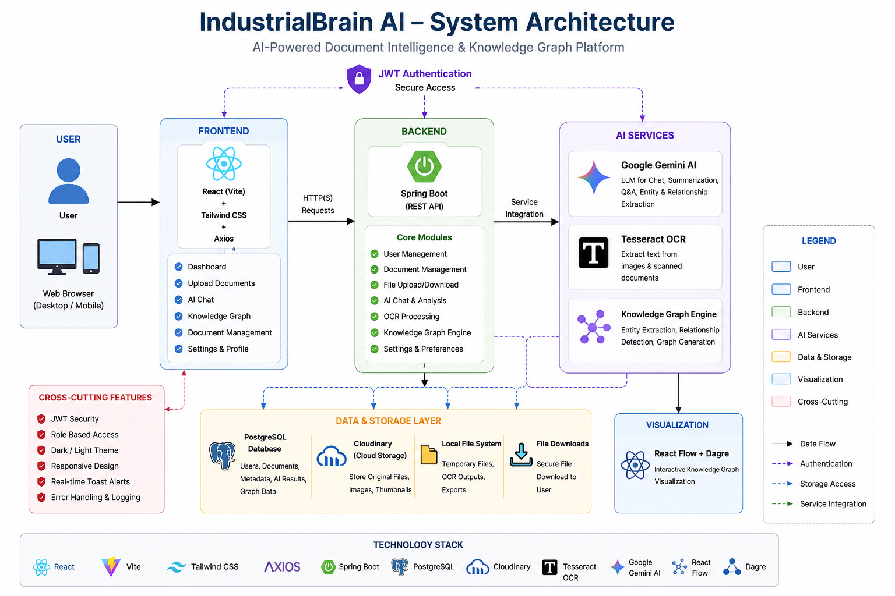
</p>

# 🤖 AI Workflow

<p align="center">
  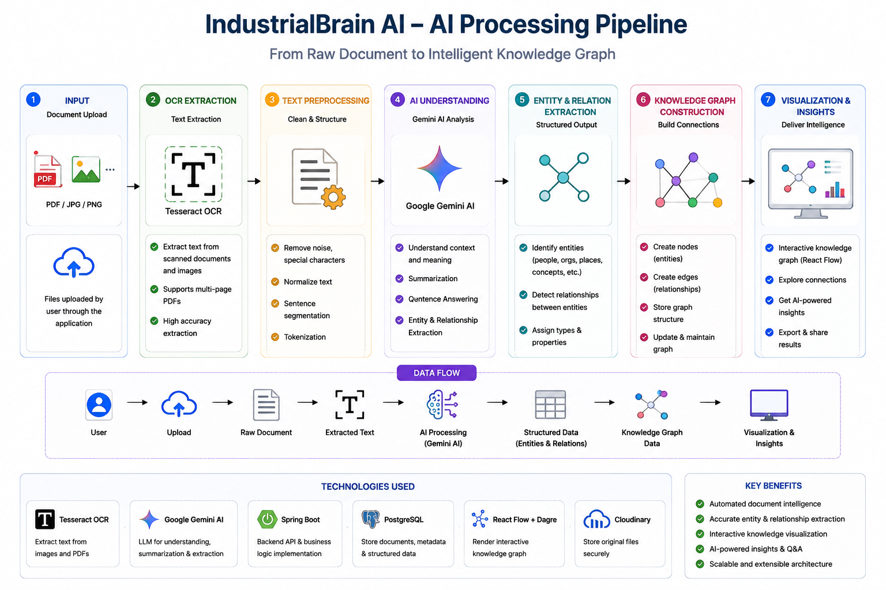
</p>

# 📂 Project Structure

```text
IndustrialBrain-AI
│
├── frontend/                 # React + Vite Frontend
│   ├── src/
│   ├── public/
│   └── package.json
│
├── spring-backend/           # Spring Boot Backend
│   ├── src/
│   ├── pom.xml
│   └── uploads/
│
├── architecture/             # Architecture diagrams
│
├── assets/                   # Images & project assets
│
├── datasets/                 # Sample industrial documents
│
├── demo/                     # Demo resources
│
├── docs/                     # Documentation
│
├── ai-engine/                # AI related resources
│
├── docker-compose.yml
├── README.md
├── LICENSE
└── .gitignore
```

# ⚙️ Installation Guide

## Prerequisites

Before running the project, ensure you have:

- Java 17+
- Maven
- Node.js 20+
- PostgreSQL
- Git
- Google Gemini API Key
- Cloudinary Account

---

## Clone Repository

```bash
git clone https://github.com/kadirisaikumar3/IndustrialBrain-AI.git

cd IndustrialBrain-AI
```

---

## Backend Setup

```bash
cd spring-backend

mvn clean install

mvn spring-boot:run
```

---

## Frontend Setup

```bash
cd frontend

npm install

npm run dev
```

---

The application will be available at:

Frontend:

```
http://localhost:5173
```

Backend:

```
http://localhost:8081
```

# 🔑 Environment Variables

Configure the following properties before running the application.

## Backend (`application.properties`)

```properties
spring.datasource.url=YOUR_DATABASE_URL
spring.datasource.username=YOUR_DB_USERNAME
spring.datasource.password=YOUR_DB_PASSWORD

jwt.secret=YOUR_SECRET_KEY

gemini.api.key=YOUR_GEMINI_API_KEY

cloudinary.cloud-name=YOUR_CLOUD_NAME
cloudinary.api-key=YOUR_API_KEY
cloudinary.api-secret=YOUR_API_SECRET
```

> **Note:** Never commit your actual API keys or secrets to GitHub.

# 🚀 Running the Project

1. Register a new account.
2. Login using your credentials.
3. Upload PDF or image documents.
4. OCR extracts text from uploaded documents.
5. Ask AI questions related to the document.
6. Generate the Knowledge Graph.
7. Click graph nodes to receive AI explanations.
8. Search and highlight nodes.
9. Export the Knowledge Graph as PNG.
10. Logout securely.

# 📡 API Overview

## Authentication

| Method | Endpoint | Description |
|---------|----------|-------------|
| POST | `/api/auth/register` | Register User |
| POST | `/api/auth/login` | Login |

---

## Dashboard

| Method | Endpoint | Description |
|---------|----------|-------------|
| GET | `/api/dashboard/stats` | Dashboard Statistics |
| GET | `/api/dashboard/documents` | User Documents |
| GET | `/api/dashboard/activity` | Recent Activities |
| GET | `/api/dashboard/trend` | Weekly Upload Trend |

---

## Documents

| Method | Endpoint | Description |
|---------|----------|-------------|
| POST | `/api/documents/upload` | Upload Document |
| GET | `/api/documents/download/{id}` | Download Document |
| DELETE | `/api/documents/{id}` | Delete Document |

---

## AI

| Method | Endpoint | Description |
|---------|----------|-------------|
| POST | `/api/ai/chat` | AI Chat |
| POST | `/api/ai/explain` | AI Document Explanation |

---

## Knowledge Graph

| Method | Endpoint | Description |
|---------|----------|-------------|
| GET | `/api/dashboard/knowledge-graph/{id}` | Generate Knowledge Graph |

# 📸 Application Screenshots

---

## 🔐 Authentication

| Login | Register |
|-------|----------|
| 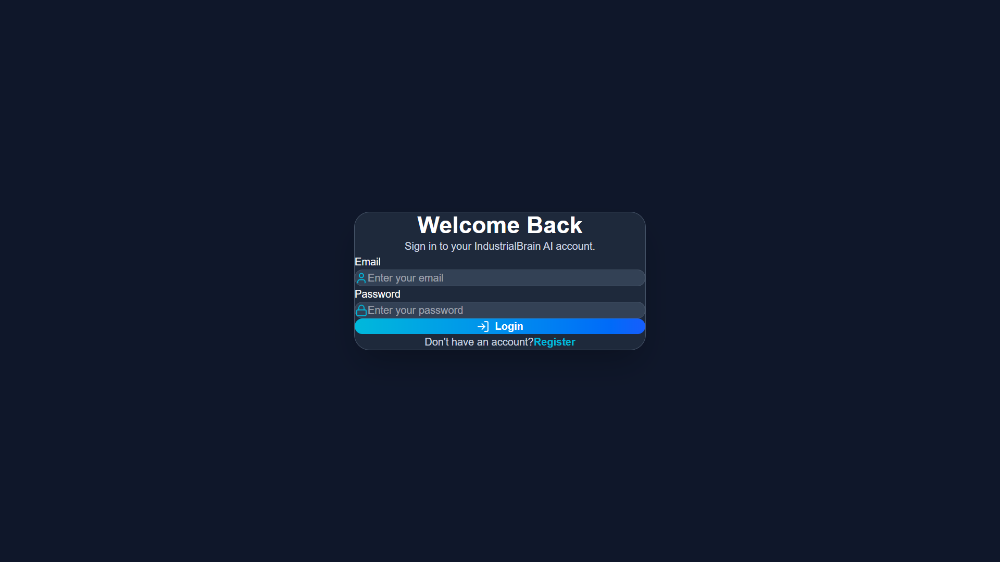 | 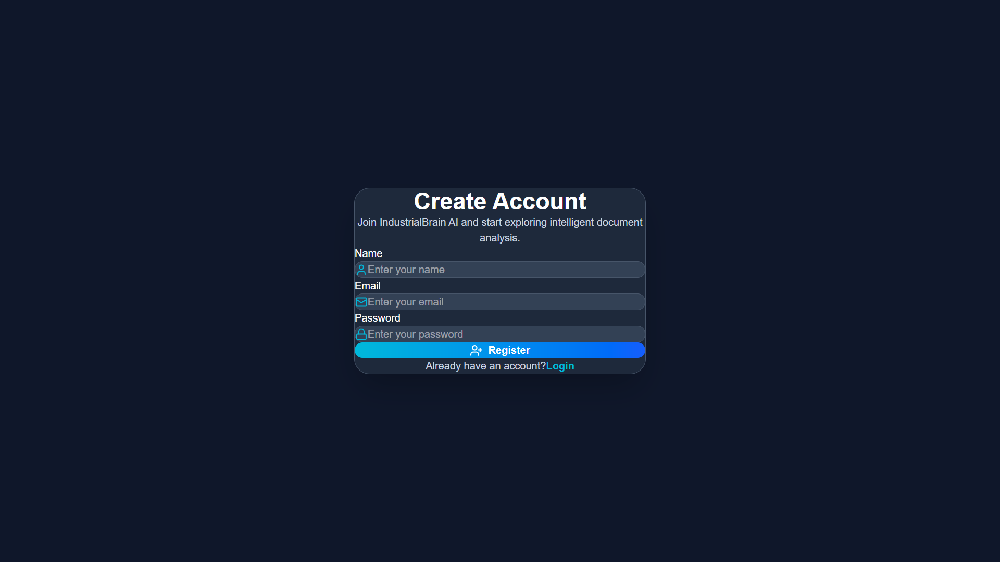 |

---

## 📊 Dashboard

| Dashboard Overview |
|--------------------|
| 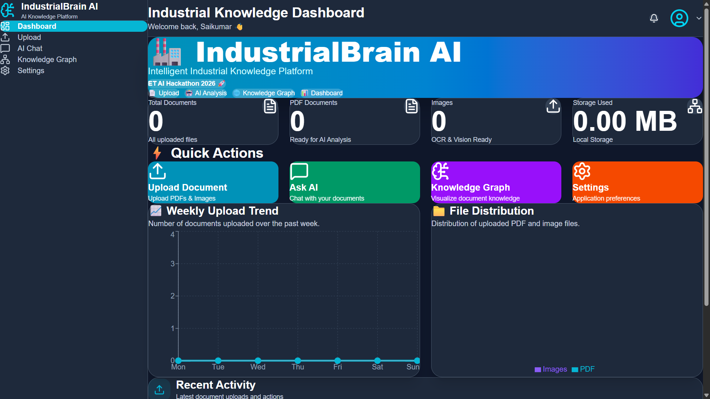 |

| Statistics | Upload Trends |
|------------|---------------|
| 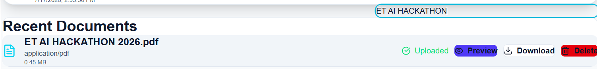 | 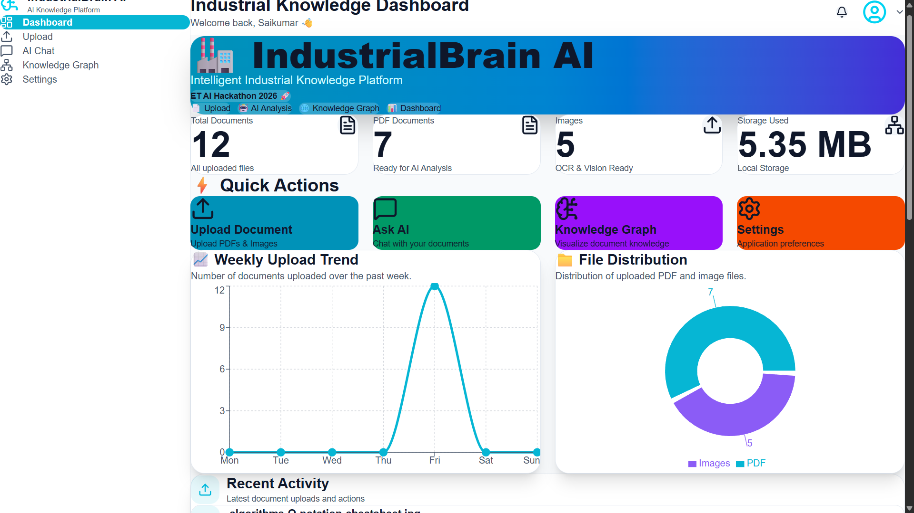 |

| File Distribution | Recent Activity |
|-------------------|-----------------|
| 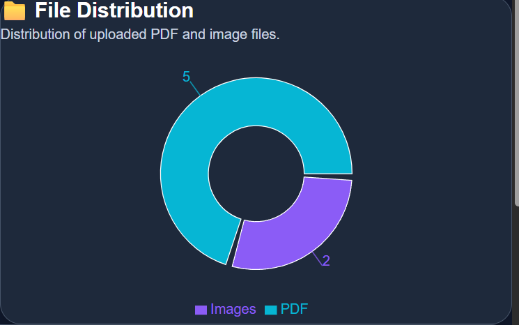 | 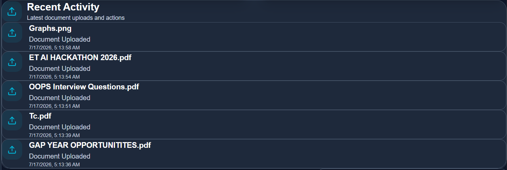 | | 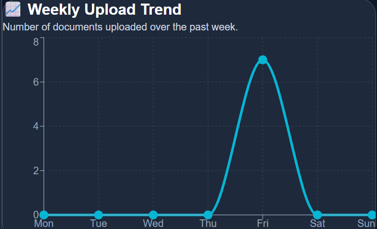 |

---

## 📂 Document Management

| Upload Document | Uploaded Documents |
|-----------------|--------------------|
| 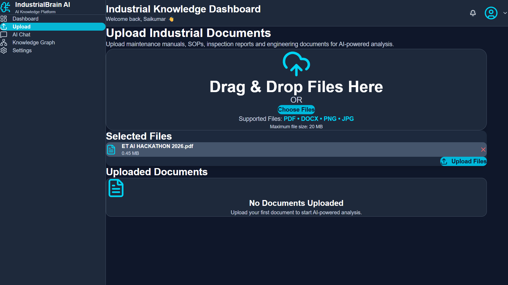 | 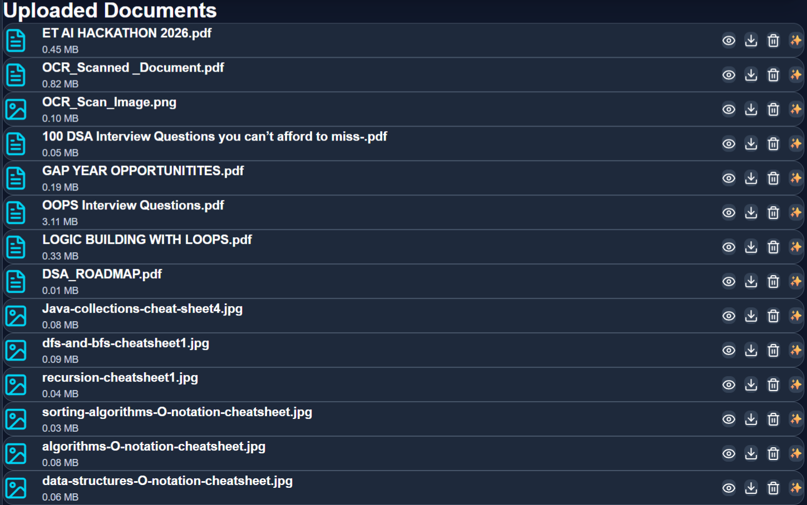 |

| PDF Preview |
|-------------|
| 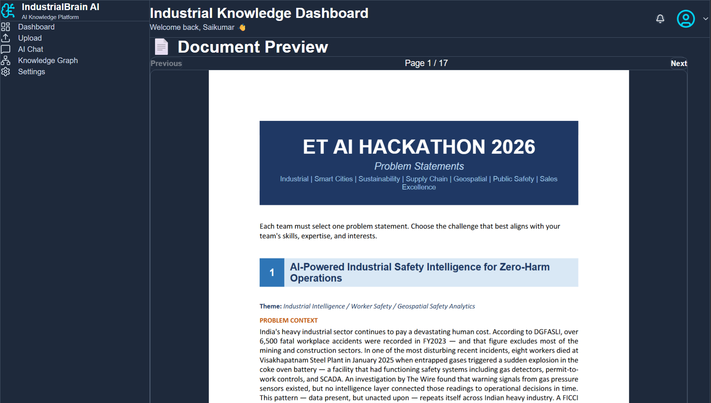 |

---

## 🤖 AI Features

| AI Chat | AI Document Explanation |
|----------|-------------------------|
| 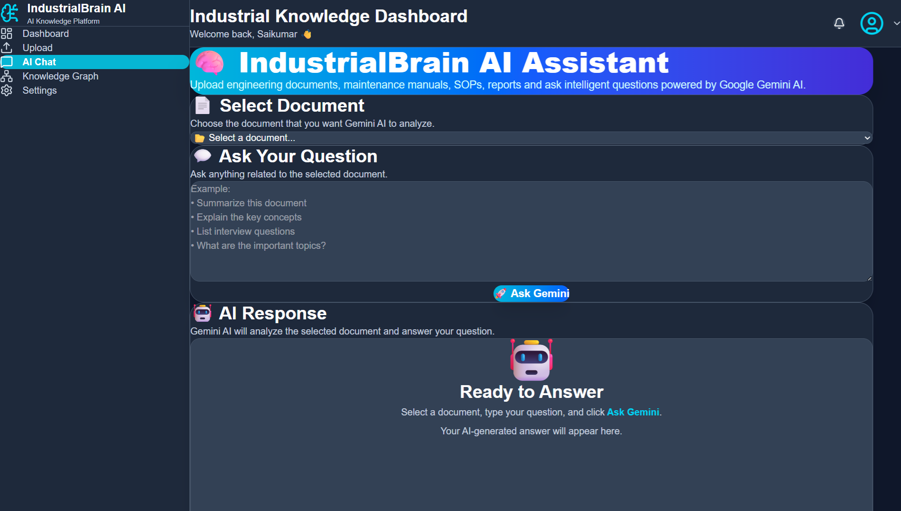 | 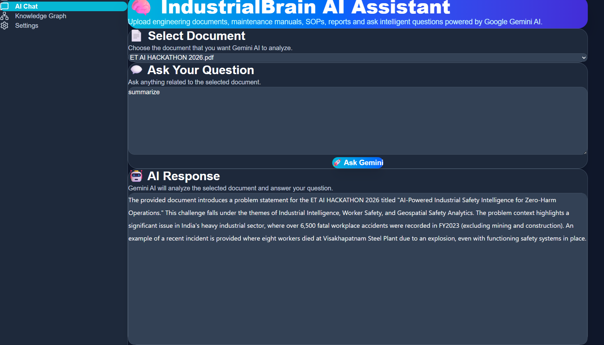 |

---

## 🧠 Knowledge Graph

| Knowledge Graph |
|-----------------|
| 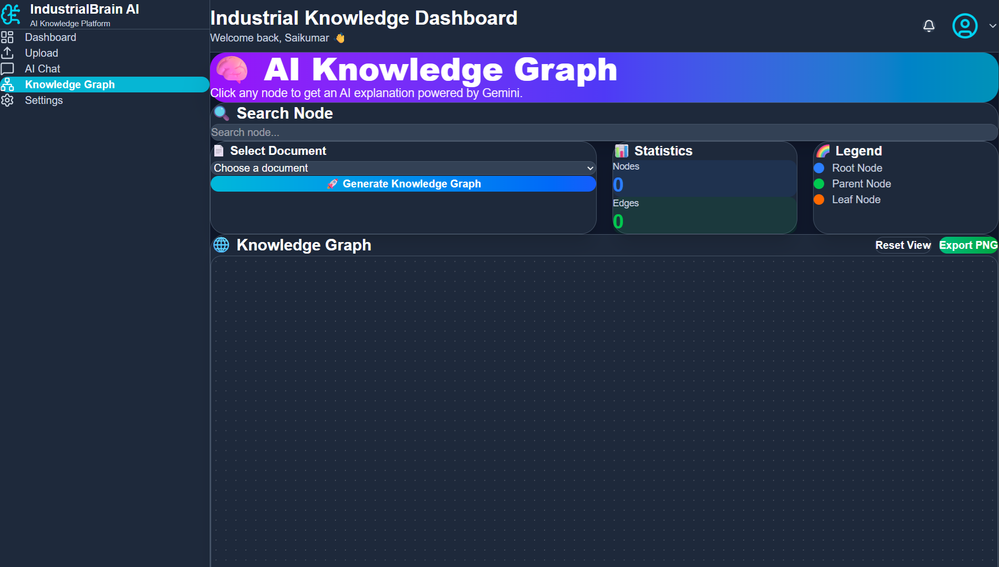 |

| Graph Search | AI Node Explanation |
|--------------|---------------------|
| 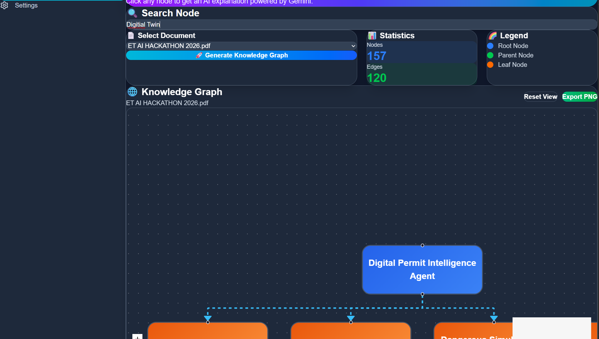 | 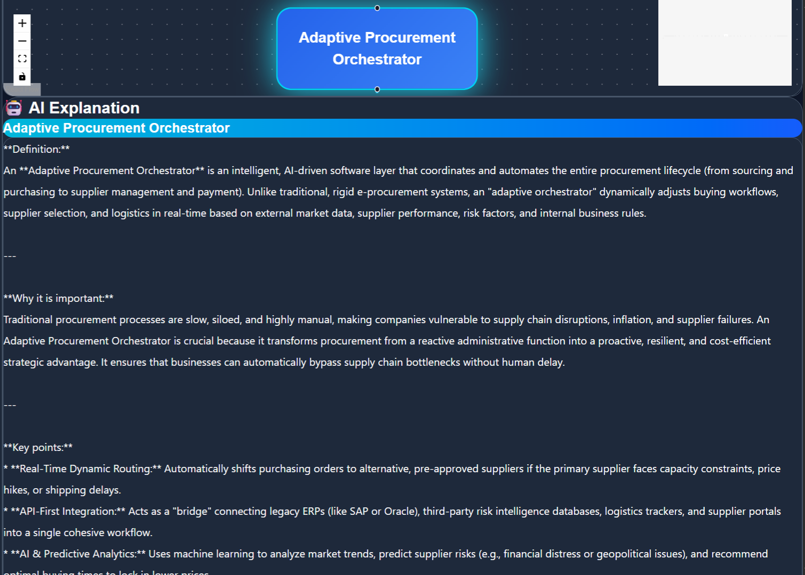 |

---

## ⚙️ User Settings

| Profile | Settings |
|----------|----------|
|  |  |  |  |

# 📄 Project Documentation

A detailed project report has been prepared covering the complete system design, implementation, architecture, workflows, AI pipeline, database design, security features, screenshots, and future enhancements.

| Document | Description |
|----------|-------------|
| 📘 [Project Documentation (PDF)](docs/IndustrialBrain-AI-Project-Documentation.pdf) | Complete project documentation in PDF format |
| 📝 [Project Documentation (Word)](docs/IndustrialBrain-AI-Project-Documentation.docx) | Editable project documentation in Microsoft Word format |

The documentation includes:

- Executive Summary
- Problem Statement
- Proposed Solution
- Key Features
- Technology Stack
- System Architecture
- AI Processing Pipeline
- Database Design
- Implementation Details
- Application Screenshots
- Security Features
- Challenges & Solutions
- Future Enhancements


# 🎥 Demo Video

A 3–4 minute demonstration video showcasing the complete workflow of IndustrialBrain AI will be added after deployment.

The demo covers:

- User Registration & Login
- Dashboard Overview
- Document Upload
- OCR Text Extraction
- AI Chat
- AI Document Explanation
- Knowledge Graph Generation
- Graph Search & AI Node Explanation
- Settings & Profile


# 🎯 Alignment with ET AI Hackathon 2.0

IndustrialBrain AI directly addresses the challenge of building an **AI-powered Industrial Knowledge Intelligence Platform** by transforming disconnected industrial documents into an intelligent, searchable, and interactive knowledge ecosystem.

### ✅ Document Intelligence
- PDF Upload
- Image Upload
- OCR Text Extraction
- Scanned Document Processing

### ✅ AI-Powered Knowledge Discovery
- Context-aware AI Chat
- AI Document Explanation
- Intelligent Question Answering

### ✅ Knowledge Engineering
- Automatic Knowledge Graph Generation
- Entity Relationship Visualization
- Interactive Node Exploration
- AI-powered Node Explanation

### ✅ Secure Document Management
- JWT Authentication
- Multi-user Support
- User-specific Document Isolation
- File Preview, Download & Delete

### ✅ Interactive Analytics
- Dashboard Statistics
- Weekly Upload Trends
- File Distribution
- Recent Activities

IndustrialBrain AI demonstrates how modern AI technologies can simplify industrial knowledge discovery, reduce information fragmentation, and improve operational efficiency through intelligent document understanding.

# 🚀 Future Enhancements

- Retrieval-Augmented Generation (RAG)
- Industrial Ontology Support
- Predictive Maintenance Intelligence
- Root Cause Analysis (RCA)
- Compliance Intelligence
- Multi-language OCR
- Voice-based AI Assistant
- Mobile Application
- Real-time Knowledge Graph Updates
- SAP / ERP Integration
- IoT Sensor Integration
- Cloud Deployment

# 👨‍💻 Author

**Saikumar Kadiri**

Aspiring Software Engineer | Java Developer | AI Enthusiast

- GitHub: https://github.com/kadirisaikumar3
- LinkedIn: https://www.linkedin.com/in/saikumarkadiri/

---

⭐ If you found this project interesting, consider giving it a star.

# 🙏 Acknowledgements

This project was developed as part of the **Economic Times AI Hackathon 2.0**.

Special thanks to the open-source community and the following technologies:

- Spring Boot
- React
- PostgreSQL
- Google Gemini AI
- Tesseract OCR
- React Flow
- Dagre
- Tailwind CSS
- Cloudinary
- Maven


# 📄 License

This project is licensed under the MIT License.

See the LICENSE file for more details.