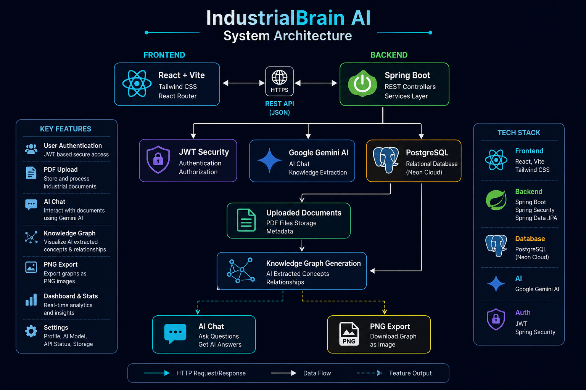
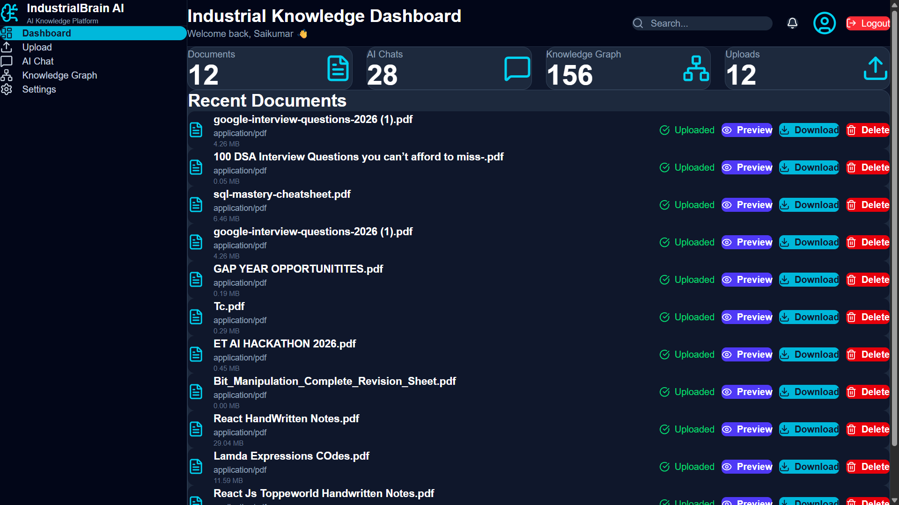
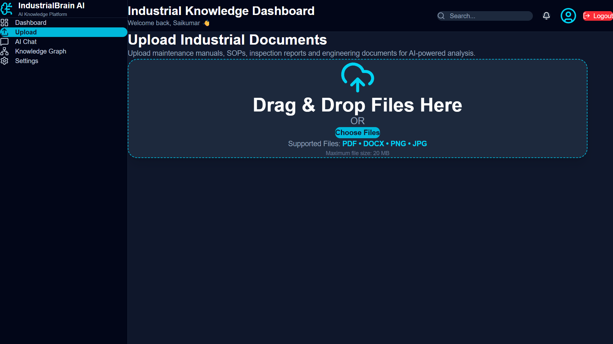
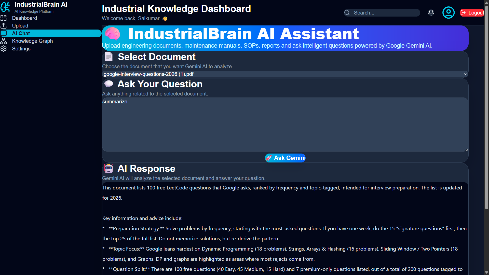
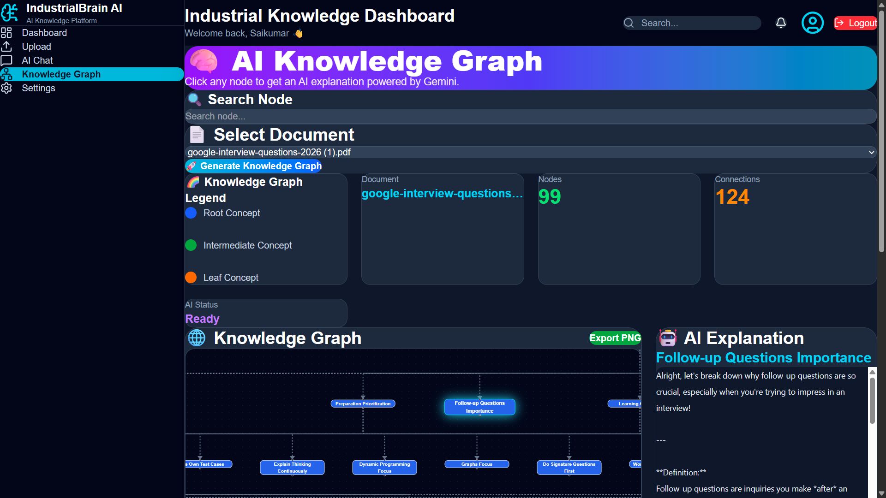
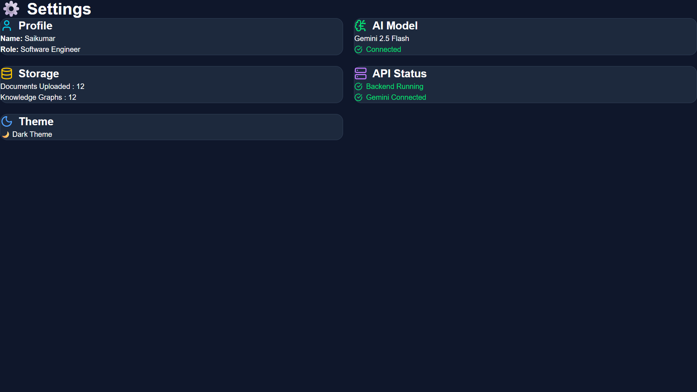

# 🧠 IndustrialBrain AI


> AI-powered Industrial Knowledge Management Platform built using React, Spring Boot, PostgreSQL, and Google Gemini AI.

---

## 🚀 Overview

IndustrialBrain AI helps engineers upload industrial documents and interact with them using AI.

Users can:

- 📄 Upload PDF documents
- 🤖 Chat with AI about uploaded documents
- 🧠 Generate Knowledge Graphs
- 🔐 Secure Authentication using JWT
- 📊 Dashboard with real-time statistics
- ⚙️ Settings page with live storage information

---

# Architecture



---

# ✨ Features

- ✅ JWT Authentication
- ✅ Secure Login & Registration
- ✅ Protected Routes
- ✅ AI Chat
- ✅ PDF Upload
- ✅ Knowledge Graph Visualization
- ✅ PNG Export
- ✅ Dashboard Analytics
- ✅ Live Settings
- ✅ Responsive UI

---

# 🛠 Tech Stack

## Frontend

- React
- Vite
- Tailwind CSS
- React Flow
- Axios
- React Router
- React Toastify

## Backend

- Spring Boot
- Spring Security
- JWT
- Spring Data JPA

## Database

- PostgreSQL

## AI

- Google Gemini API

---

# 📂 Project Structure

```text
IndustrialBrain-AI
│
├── frontend
│
├── spring-backend
│
└── assets
```

---


# 📸 Screenshots

## Dashboard



---

## Upload Documents



---

## AI Chat



---

## Knowledge Graph



---

## Settings


---

# ⚙️ Installation


## Clone Repository

```bash
git clone https://github.com/kadirisaikumar3/IndustrialBrain-AI.git
```

## Frontend

```bash
cd frontend
npm install
npm run dev
```

## Backend

```bash
cd spring-backend
./mvnw spring-boot:run
```

---

# 🔐 Authentication

- JWT Authentication
- BCrypt Password Encryption
- Protected Routes
- Logout

---

# 🧠 Knowledge Graph

- AI-generated concepts
- Interactive React Flow visualization
- PNG Export

---

# 🚀 Future Improvements

- Multi-user support
- Dark / Light Theme
- Graph Search
- PDF Reports
- AI Analytics
- Smarter Graph Layout
- Cloud Storage

---

# 👨‍💻 Author

## Saikumar Kadiri

Aspiring Software Engineer passionate about building scalable AI-powered applications using Java, Spring Boot, React, and PostgreSQL.

### Connect with me

- **LinkedIn:** https://www.linkedin.com/in/saikumar-kadiri/
- **GitHub:** https://github.com/kadirisaikumar3

---

# ⭐ Support

If you like this project, consider giving it a ⭐ on GitHub.